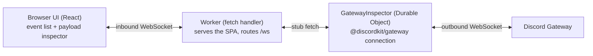

# Spec — `with-cloudflare`, the Gateway Event Inspector

> Status: **Draft for review** · Owner: Drake Costa · Date: 2026-08-14
> Scope of v0: a **live Gateway event inspector** — "DevTools for the Discord Gateway" —
> running on a **Cloudflare Worker + Durable Object**, runnable locally and in CI.

## 1. Goal

Give `@discordkit/gateway` a flagship example that is **independently useful to a Discord
developer**, matching the bar set by [`with-electron`](../examples/with-electron) (Rich
Presence Visualizer) and [`with-tauri`](../examples/with-tauri) (Friends List Studio):
each is a tool someone would open on purpose, not a demo of library syntax.

It also serves as the **reference implementation of the Workers/Durable Object target**
the gateway package was designed against — the one runtime claim in the
[gateway package spec](./gateway-package-spec.md) that no code had yet exercised.

Non-goals for v0: sending messages or otherwise acting as a bot, multi-guild analytics,
persistence beyond a session, sharding. It is a **read-only observation tool**.

## 2. Key findings that shaped this design

**These are the load-bearing facts; if any turns out wrong, the plan changes.**

1. **Nobody has built a Gateway inspector.** Discord's only official sample,
   [discord/discord-example-app](https://github.com/discord/discord-example-app), is
   rock-paper-scissors over **HTTP interactions — not the Gateway at all**. The community
   [`discord-gateway` topic](https://github.com/topics/discord-gateway) is either
   infrastructure ([spec-tacles/gateway](https://github.com/spec-tacles/gateway), a broker)
   or teaching artifacts ("connect without discord.js"). Searching specifically for a
   Gateway event viewer/inspector returns **no GUI tool**. Developers debug the Gateway
   with `console.log` archaeology.

2. **The Gateway's defining pain is a silent failure, and it is very well documented.**
   Without the privileged `MESSAGE_CONTENT` intent a bot still receives every
   `MESSAGE_CREATE` — with `content` as an empty string. In developers' own words:

   > Your command matching compares `""` against `"!help"`, finds no match, and does
   > nothing — with no error, no exception and no log line.

   > "Bot offline" and "bot online but silent" are completely different failures. Most
   > wasted debugging time comes from treating them as the same problem.

   There is [a real issue filed against a shipping project](https://github.com/openclaw/openclaw/issues/27001)
   for exactly this. **Making this visible is the tool's headline feature.**

3. **Intents calculators are a saturated space — do not build one.**
   [ziad87](https://ziad87.net/intents/),
   [XGamingServer](https://xgamingserver.com/tools/discord-bot/intent-calculator),
   [DiscordGate](https://discordgate.com/tools/intents-calculator),
   [Larkooo](https://github.com/Larkooo/discord-intents-calculator) and several more
   already exist, and one is embedded in Discord's own docs. A seventh adds nothing.
   The inspector may _display_ the active intent mask, but computing one is not the point.

4. **Cloudflare's local tooling is better than the gateway spec assumed — celld is not
   needed.** `wrangler dev` runs Durable Objects locally through **Miniflare, which
   executes the real workerd runtime**, not a reimplementation. SQLite-backed DO storage
   works locally; it in fact works _only_ locally, since
   [`wrangler dev --remote` rejects SQLite DOs](https://github.com/cloudflare/workers-sdk/issues/9239).
   → The example runs **offline, with no Cloudflare account**, while still targeting a
   real deployment. celld remains what the package spec called it: a self-hosting escape
   hatch to re-verify if we ever need it, not a development dependency.

5. **⚠️ WebSockets in DOs break `vitest-pool-workers`' default isolation.** Per
   [Cloudflare's known issues](https://docs.cloudflare.com/workers/testing/vitest-integration/known-issues/),
   WebSockets are unsupported with per-file storage isolation; the documented workaround
   is `--max-workers=1 --no-isolate`. Since holding a WebSocket is this DO's entire job,
   the example's `test` task must encode that from the start, with a comment — otherwise
   it surfaces as a mystery CI failure.

6. **Our examples' shared DNA: collapse a painful feedback loop.** Rich presence normally
   needs a second account to observe; a friends list needs a populated social graph. Each
   example makes an invisible surface immediate and tunable. The Gateway's equivalent is
   that **its traffic is invisible** — this example makes it watchable.

## 3. What it is

A single-page web app, served by a Worker, showing a **live stream of Gateway traffic**
for a bot token you supply.

```
┌─ Connection ─────────────────────────────────────────────┐
│ ● ready   session 4f2a…   seq 1247   ↑ 41s   resumes 2   │
│ intents: GUILDS, GUILD_MESSAGES ⚠ MESSAGE_CONTENT missing│
└──────────────────────────────────────────────────────────┘
┌─ Events ──────────────────┐┌─ Payload ───────────────────┐
│ ▸ MESSAGE_CREATE   12:04.1││ {                           │
│ ⚠ MESSAGE_CREATE   12:04.3││   "content": "",  ⚠ empty   │
│ ▸ TYPING_START     12:04.9││   "channelId": "…",         │
│ ▸ PRESENCE_UPDATE  12:05.2││   …                         │
│ ○ HEARTBEAT_ACK    12:05.4││ }                           │
└───────────────────────────┘└─────────────────────────────┘
```

Four things no existing tool shows:

- **The lifecycle, not just dispatches.** `HELLO`, the heartbeat interval and its jitter,
  `IDENTIFY`, `HEARTBEAT`/`ACK` pairs, `RESUME` vs. re-`IDENTIFY`, `INVALID_SESSION`, and
  close codes with their resumability. Every library hides this; it's exactly what you
  need when a connection misbehaves.
- **Empty-field detection.** When a `MESSAGE_CREATE` arrives with empty `content` and
  `MESSAGE_CONTENT` isn't in the active mask, say so in the UI — naming the missing
  intent instead of leaving a silent empty string. This is finding #2, solved.
- **Intent attribution.** Each event is labelled with the intent that gated it (from the
  generated `EVENT_INTENTS` map), plus a live list of events you are **not** receiving
  because their intent wasn't requested.
- **Raw vs. parsed.** Toggle Discord's snake_case wire payload against the camelized
  shape discordkit hands your code — which also makes
  [the camelize boundary](./gateway-package-spec.md) legible rather than mysterious.

## 4. Architecture



- **Worker** — serves the static SPA and upgrades `/ws`, forwarding to the singleton DO.
  Stateless, so it stays free.
- **`GatewayInspector` DO** — holds the one outbound Gateway socket (Discord permits a
  single session per bot) and fans events out to every connected browser. This is the
  package's ambient-vs-explicit design paying off: the DO passes an **explicit**
  `connection`, since module globals are per-isolate.
- **DO SQLite** — a rolling buffer of recent events so a page refresh doesn't lose the
  session, and so "replay" works.

The DO is the natural home for exactly the reason the package spec gives: a Gateway
connection is a persistent, singleton, outbound WebSocket, and a DO is the only
serverless primitive that offers one.

## 5. Running it

| Mode   | Command                               | Needs                                |
| ------ | ------------------------------------- | ------------------------------------ |
| Local  | `vp run dev` → `wrangler dev`         | nothing but a bot token              |
| Tests  | `vp run test` → `vitest-pool-workers` | nothing (mock gateway via MSW)       |
| Deploy | `wrangler deploy`                     | the user's own CF account (optional) |

**The token never leaves the user's machine in local mode**, and is never committed —
supplied via Varlock, consistent with the other examples. Per the repo's standing rule:
we drive, the user holds tokens.

E2E follows the existing examples: MSW-scripted Gateway frames rather than live Discord,
so CI needs no credentials. Port assignment continues the established scheme (nextjs=3100,
better-auth=3000, tanstack=3200, waku=3300, astro=4321) — this one takes **3400**.

## 6. What it demonstrates about the architecture

Incidental to being useful, it exercises the claims the package makes:

- **Tree-shaking** — the DO imports only the events it inspects.
- **Web-standard `WebSocket`** — the same `connection.ts` code path runs on workerd with
  no Node shim, which is the runtime claim nothing had yet proven.
- **Explicit connections** — the per-isolate case the ambient singleton deliberately
  doesn't cover.
- **`EVENT_INTENTS`** — the generated map becomes user-facing UI, not just internals.

## 7. Open questions

1. **Does `@discordkit/gateway` run unmodified on workerd?** Everything says yes (Web
   standard `WebSocket`, no Node builtins on the hot path), but **this is unverified** —
   it is the first thing to test, before any UI work, because a negative result changes
   the package, not just the example.
2. **Buffer size.** How many events to retain in DO SQLite before rolling. Pick something
   small and defensible; a busy guild produces a lot of `TYPING_START`.
3. **Does the free tier comfortably cover an on-demand inspector?** The package spec
   budgeted an always-on DO at ~11,000 GB-s/day against a 13,000 limit. An inspector is
   only connected while someone is watching, so it should be far under — worth confirming
   rather than assuming.
