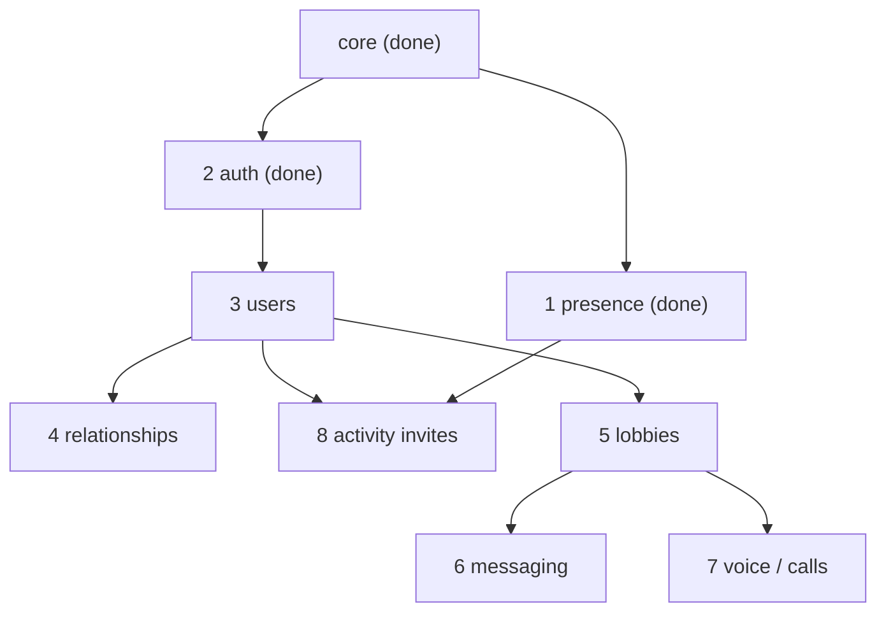

# Plan — `@discordkit/native` full Social SDK API coverage

> Companion to `social-sdk-native-bridge-spec.md`. That spec settled the **package
> shape** (ambient singleton, free-function ops, subpath tree-shaking, ERM cleanup)
> and the **infrastructure phases** (P0–P5: core → electron → tauri → CLI). This
> document adds the orthogonal axis the spec deferred: **the API-domain slices**
> that fill in the full `discordpp` surface — comparable in ambition to the REST
> client's coverage. Rich presence + auth (done) are the first two of these.

SDK version covered: **1.9.16441** (`social-sdk-docs/api/1.9.16441/`). 32 classes +
the `discordpp` namespace; 507 C ABI functions in `cdiscord.h`, all bindable (no
C++-only gaps that block a slice — verified by per-domain function counts).

---

## 1. Conventions (proven on presence + client; binding for every slice)

These are settled — encoded in the committed presence refactor and the
`native-class-vs-function-rule` / `social-sdk-api-design` memories. A slice that
deviates must justify it.

### 1.1 File layout: one module per `discordpp` C++ class

A feature **domain** is a folder (`presence/`, `auth/`, `lobby/`, …). Inside it,
**one file per C++ class**, named for the class (`activityAssets.ts`,
`lobbyMember.ts`), each owning that class's bindings + its `buildX`/accessor +
its types + its doc-derived JSDoc. The domain's client-level operations and
orchestration live in a `*.ts` named for the feature (`richPresence.ts`,
`authorize.ts`), and an `index.ts` barrel re-exports the public surface. This
mirrors `social-sdk-docs/api/<version>/<Class>.md` 1:1, so porting docs → JSDoc
is mechanical and diffs carry filename-level signal.

The export map gets one explicit entry per domain folder
(`"./presence": "./src/presence/index.ts"`), keeping the public subpath stable;
`"./*"` continues to resolve nested files for deep imports.

### 1.2 The `Client` class is distributed, never centralized

`Client` has 229 members — it is not a feature, it's where Discord hung _every_
feature's entry points (`Client::Authorize`, `Client::UpdateRichPresence`,
`Client::CreateOrJoinLobby`, `Client::SendUserMessage`, …). **Do not** make a
`client.ts` binding file with 229 functions. Each `Client::*` method is declared
by the **domain that owns it** (the auth slice declares `Client_Authorize`; the
lobby slice declares `Client_CreateOrJoinLobby`). The core `DiscordClient` class
(in `client.ts`) binds ONLY the lifecycle/status/log functions every consumer
needs; feature C functions are bound lazily in their feature module via
`defineBindings`. This is the tree-shaking boundary and the anti-god-object rule.

### 1.3 Shared FFI helpers (`ffi/bindings.ts`)

Every slice builds on these (already shipped):

- **`defineBindings(decls)`** → `(lib) => bindings`: declarative C-signature /
  callback-prototype map with a per-library lazy cache. Replaces the hand-rolled
  `WeakMap` + factory.
- **`awaitResult(client, cbType, start, onResult, opts)`**: the callback→promise
  bridge (register → track → timeout → read `ClientResult`). Every async SDK op
  (`Authorize`, `GetToken`, `CreateOrJoinLobby`, `SendUserMessage`, …) is one
  call. `onResult` maps the post-`result` callback args to the resolved value.
- **`isResultSuccessful` / `resultErrorMessage`**: shared `ClientResult` readers.
- **`SubObjectHandle` + `subObjectHandle(handle, drop)`**: a `using`-disposable
  for transient native handles built to attach to a parent (assets→activity,
  and later lobby-transaction objects, message-create objects, etc.). Collect
  several on a `DisposableStack` when a parent needs N of them.

### 1.4 Class vs function vs `using` (the lifetime rule)

- **Consumer-owned handle that escapes** → a flat `class` (no inheritance) with
  `#private` state + `[Symbol.dispose]`, like `DiscordClient`. The SDK's `*Handle`
  classes (`LobbyHandle`, `UserHandle`, `MessageHandle`, `CallInfoHandle`,
  `ChannelHandle`, `VoiceStateHandle`, `RelationshipHandle`) are candidates **iff**
  we hand them back to the consumer as live, disposable objects. If we instead
  read them into plain JS snapshot objects (see §1.5), they are NOT classes.
- **Transient internal handle** → `SubObjectHandle` + `using`.
- **Stateless op** → free function taking the client via options. Never a method.
- **Never** `extends`. Never a feature op as a client method.

### 1.5 Types over schemas; snapshots over live handles (default)

Per `social-sdk-api-design`: this package does NOT need Valibot for everything —
there's no network payload to validate. **Default: plain TS `interface`s.** A
read-side SDK handle (e.g. `UserHandle` with `Id()`/`Username()`/`Avatar()`
getters) is, by default, **read once into a plain snapshot object**
(`interface User { id: bigint; username: string; … }`) rather than surfaced as a
live wrapper class — simpler, GC-friendly, no dispose burden on the consumer.

Reach for a **class wrapper** only where the handle is genuinely long-lived and
interactive (a `Lobby` you keep and act on, a `Call` you control). Reach for a
**Valibot schema** only where it earns its place:

- driving **form validation** (as in `with-electron`), or
- driving **Valimock** to generate mock data for E2E tests that run without the
  real SDK (likely valuable for the CI binary gap — see spec §6).
  Decide per-slice; default to interfaces.

### 1.6 Per-slice "definition of done"

A slice ships, for each operation in scope:

1. the functional FFI op (the public export) + its lazily-bound C declarations,
2. its shared types (interfaces; schema only where §1.5 applies),
3. JSDoc ported from `social-sdk-docs/api/<version>/` (prose + the C-ABI signature
   block), with the version noted,
4. unit tests against the mock FFI backend — **granular and co-located** (see
   §1.7),
5. the tree-shaking assertion extended (the new domain imports no sibling domain),
6. a **bumpy bump file** for the slice (`@discordkit/native` minor) describing
   what it added (see §3 — these accumulate into the package changelog).

### 1.7 Test layout: granular, co-located, shared utilities

Mirror the REST client's test strategy — **not** one giant `presence.spec.ts`-style
file per domain. Co-locate small spec files with the code, scoped to one operation
or class:

```
presence/__tests__/
  setActivity.spec.ts        ← the op + its marshaling
  clearActivity.spec.ts
  activityParty.spec.ts      ← per-sub-object build/skip rules
  activityButton.spec.ts
```

Derive **shared testing utilities** where it keeps basic tests predictable and
consistent — e.g. a helper to spin up a mock-backed client + read its recorded
calls, assertion helpers for "this op bound + invoked these C functions in order,"
fixture builders. These live in a `__tests__/` support module (or a small
`testing/` internal), reused across slices so every binding test reads the same
way. The existing `testBackend.ts` is the seed; grow it per slice with the new
`Discord_*` cases, but keep the _assertions_ in the small co-located specs.

---

## 2. Feature domains (the slice map)

Derived from the 32 classes + the `Client::*` method clustering. Each row is a
subpath module. "Client methods" = the `Client::*` entry points that domain owns.

| #   | Domain (subpath)     | Owns these classes                                                                                | Key `Client::*` methods                                                                         | C fns | Status                                        |
| --- | -------------------- | ------------------------------------------------------------------------------------------------- | ----------------------------------------------------------------------------------------------- | ----- | --------------------------------------------- |
| —   | **core** (`.`)       | Client (lifecycle only), ClientResult, ClientCreateOptions                                        | Init/Drop/SetApplicationId/Run­Callbacks/status+log/version                                     | ~15   | ✅ done                                       |
| 1   | **presence**         | Activity, ActivityAssets, ActivityTimestamps, ActivityParty, ActivityButton, ActivitySecrets      | UpdateRichPresence, ClearRichPresence                                                           | ~110  | ✅ done                                       |
| 2   | **auth**             | AuthorizationArgs, AuthorizationCodeVerifier, AuthorizationCodeChallenge, DeviceAuthorizationArgs | Authorize, GetToken(+Device/Provisional), UpdateToken, Connect, default-scopes                  | ~40   | ✅ done (args/device/provisional gaps remain) |
| 3   | **users**            | UserHandle, UserApplicationProfileHandle                                                          | GetCurrentUser, GetUser, GetCurrentUserV2, user-update callbacks                                | ~25   | TODO                                          |
| 4   | **relationships**    | RelationshipHandle                                                                                | GetRelationships, Update/Accept/Decline friend requests, Block/Unblock, game vs Discord friends | ~20   | TODO                                          |
| 5   | **lobbies**          | LobbyHandle, LobbyMemberHandle, LinkedLobby, LinkedChannel, GuildChannel, GuildMinimal            | CreateOrJoinLobby, Leave, GetLobby, lobby metadata, channel-linking                             | ~50   | TODO                                          |
| 6   | **messaging**        | MessageHandle, ChannelHandle, AdditionalContent, UserMessageSummary                               | SendUserMessage, SendLobbyMessage, GetMessage, Get/Delete user messages, message callbacks      | ~50   | TODO                                          |
| 7   | **voice / calls**    | Call, CallInfoHandle, VoiceStateHandle, AudioDevice, VADThresholdSettings                         | StartCall(s), EndCall(s), input/output volume + device, self-mute/deaf, VAD                     | ~60   | TODO                                          |
| 8   | **activity invites** | ActivityInvite                                                                                    | SendActivityInvite, AcceptActivityInvite, request-to-join, invite callbacks                     | ~25   | TODO                                          |
| —   | **namespace**        | free functions + enums + typedefs                                                                 | —                                                                                               | ~50   | folded into the owning slice                  |

Enums/typedefs from `namespace.md` are placed in the domain that uses them
(e.g. `ActivityActionTypes` → activity invites; `RelationshipType` →
relationships), not a dumping-ground file.

## 3. Recommended slice order (dependency-driven)



1. **users (3)** next — smallest, unblocks everything that returns a user
   (relationships, messaging authorship, lobby members). Establishes the
   read-handle→snapshot convention (§1.5) that most later slices reuse.
2. **relationships (4)** — self-contained, high user value (friends list), good
   second proof of the convention on a callback-heavy surface.
3. **activity invites (8)** — bridges presence + users; modest size; completes the
   "rich presence" story (join/spectate).
4. **lobbies (5)** — the biggest dependency hub (messaging + voice attach to it);
   first slice likely to want a live **`Lobby` class wrapper** (§1.4) and possibly
   a Valibot schema for lobby metadata patch ops.
5. **messaging (6)** — depends on lobbies + users; AdditionalContent is the
   "can't render in-game" surface.
6. **voice / calls (7)** — largest and most stateful (live `Call` object, device
   enumeration, volume); do last while the conventions are most mature.

**Delivery: one PR, one commit per slice.** The whole native package is built on
the existing `feat/social-sdk-native-bridge` branch / draft PR #60 — we are not
opening a PR per slice. Each slice lands as a **single focused commit** with its
own **bumpy bump file** (`@discordkit/native` minor). Bumpy accumulates pending
bump files and merges them at release time, so the per-slice descriptions
**combine into the package's changelog entry** (verified against the bumpy docs:
multiple change files for one package consolidate, each contributing its line).
This gives us a clean per-slice narrative in `git log` _and_ a complete changelog,
without PR overhead.

Slices 3–8 are all **within spec phase P1's spirit** (core API coverage); they
can proceed in parallel with P2+ (electron/tauri) since those are adapter layers
over whatever surface exists.

## 4. Cross-cutting, applied as slices land

- **Mock-backend coverage** grows per slice (§1.6.4); the mock (`testBackend.ts`)
  gains the new `Discord_*` cases each slice needs.
- **E2E without the real SDK**: this is where §1.5's Valimock option pays off —
  schemas for the read-handle snapshots let us generate believable fixtures so
  examples/tests run in CI. Evaluate when the first read-heavy slice (users)
  lands; if it works, retrofit.
- **Examples**: NOT one-per-slice. `with-electron` is intentionally
  presence-only (it _is_ a presence visualizer) and is mostly complete — we don't
  bolt other domains onto it. Other parts of the package get demonstrated as
  **well-scoped tools built inside a given integration context**, of which we have
  two more planned: the **Tauri sidecar** and the **Tauri Rust crate** (spec P3/P4).
  What those tools demonstrate is decided when we build them. If other native
  integration contexts emerge later, they become the real-world homes for
  exercising other domains. So: API slices land with mock-backed unit tests as
  their proof; example coverage follows the _integration_ roadmap, not the API
  roadmap.
- **Docs/JSDoc**: ported per-slice from the versioned cache; a future SDK bump
  re-runs `vp run scrape:sdk-docs` into a new `api/<version>/` and the diff drives
  the update (the versioned-subfolder design exists for exactly this).

## 5. Resolved decisions (owner-confirmed 2026-06-14)

Practice **Iteration-Driven Development**: these are the starting positions;
revisit any of them based on first-hand usage as slices land.

1. **Read handles → snapshot by default (§1.5). CONFIRMED.** Read SDK `*Handle`
   getters into plain interface snapshots; reserve class wrappers for genuinely
   interactive `Lobby`/`Call`. Expect to adjust per-handle once we have hands-on
   experience — the right call is often only clear from use.
2. **Slice order: as listed (§3). CONFIRMED.** users → relationships → invites →
   lobbies → messaging → voice.
3. **Valibot/Valimock: build now, selectively. CONFIRMED.** Don't defer. The work
   is _identifying_ what must be a schema vs. what is safe as an interface-only
   type. Heuristic: a type gets a schema when it (a) drives form validation in an
   example, or (b) needs Valimock-generated fixtures for SDK-less E2E. Pure
   internal/read-only shapes stay interfaces. Decide per type as each slice lands.
4. **Cross-domain `Client::*` ownership. CONFIRMED.** The domain whose _return
   type_ the method produces owns the binding; other domains import the function.
   Refactor if it proves a real problem.

## 6. Iteration-Driven Development (working mode)

The whole build-out runs IDD: we don't lock conventions in the abstract and march;
we apply them, _use_ the result, and refine. Concretely — after the first
read-heavy slice (users) lands and we've consumed it, re-examine §1.5
(snapshot-vs-wrapper) and §1.7 (testing utilities) before committing slices 4+ to
the same shape. The conventions in §1 are the current best guess, not a frozen
contract; each is cheap to adjust early and expensive to adjust late, so the early
slices (users, relationships) double as convention-validation.
