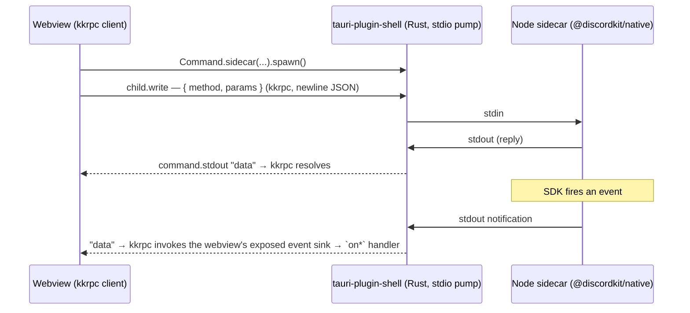

# Spec — `@discordkit/tauri` (Tauri sidecar plugin)

> Status: **Settled architecture** · Owner: Drake Costa · Date: 2026-06-15
> Companion to `social-sdk-native-bridge-spec.md` (the v0 draft that first sketched
> the Tauri story) and `electron-bridge-composable` patterns proven in
> `@discordkit/electron`. This document **settles the open Tauri questions** that
> draft left (its §9 Q1/Q2) with research-backed decisions, and **supersedes the
> draft's assumption** that we'd ship both a Node sidecar *and* a native
> Rust-`bindgen` plugin. We ship **one** thing: a Tauri plugin whose backend is a
> Node sidecar.

SDK target: **1.9.16441** (same as `@discordkit/native`). This package adds **zero**
new SDK-surface code — it is a transport shell over `@discordkit/native`.

---

## 1. What we're building, in one paragraph

A **Tauri plugin** — distributed as a Cargo crate (`tauri-plugin-discordkit`) plus an
npm package (`@discordkit/tauri`) — that lets a Tauri app drive the Discord Social
SDK from its webview. The SDK runs in a **Node sidecar** process (it must — see §2),
and the webview talks to it as a **typed RPC proxy over stdio**, with Tauri's Rust
core acting as a **domain-blind byte pump** between the two. All Discord logic stays
in JavaScript, reusing `@discordkit/native` verbatim; the Rust never grows as we add
features.

## 2. Why a Node sidecar (and not Tauri's Rust core)

`@discordkit/native` binds the SDK through **Koffi**, a *runtime* Node FFI that
`dlopen`s the platform library and declares functions from signature strings. It
cannot run inside Tauri's Rust core — that's a different runtime. So the keystone runs
where Node runs: a **sidecar process** Tauri spawns and supervises.

The alternative the original draft floated — a native **Rust `bindgen` crate** that
re-binds `cdiscord.h` in Rust — is **dropped from scope** (§7). It would be a second,
parallel implementation of the entire SDK surface to keep in lockstep with the JS one
forever. The whole low-maintenance invariant of discordkit's adapters is that the SDK
surface lives in **exactly one place** (`@discordkit/native`) and every adapter
(Electron, Tauri) is a thin transport shell over the **same** per-domain contracts.
A bindgen crate breaks that invariant. We only revisit it if a concrete "zero Node
runtime" requirement ever appears.

## 3. Transport: stdio JSON-RPC via [`kkrpc`](https://github.com/kunkunsh/kkrpc)

Tauri gives us three plausible transports between webview and sidecar: a **localhost
server**, **stdin/stdout**, or **local sockets**. The official docs are deliberately
neutral between them but give one steer above the choice: *"The Rust↔Webview IPC in
Tauri is pretty solid, and you should aim for that most of the time."* That is a vote
against opening a raw network surface.

We use **stdio JSON-RPC routed through Rust**, via `kkrpc`:

- **Why stdio over a localhost socket.** A loopback socket is reachable by any local
  process, so it needs a port/pipe + an auth-token handshake to be safe, plus a `ws`
  dependency and connect/reconnect lifecycle. Its only real advantage is
  high-throughput duplex streaming — which **we do not have** (no audio bytes cross
  this boundary; voice is device control + events). Routing through Rust keeps the
  surface inside Tauri's permission model, where it belongs.
- **Why `kkrpc` over hand-rolling a framer.** `kkrpc` independently converged on
  *exactly* this architecture — *"Rust handles lifecycle and I/O transport, but the
  RPC protocol remains end-to-end JavaScript; Rust just forwards the bytes"* with
  newline framing — and ships **first-class Tauri sidecar support** (its
  `TauriShellStdio` adapter + `RPCChannel`). It's Apache-2.0, dependency-light
  (transports live behind subpath exports, so we pull only the stdio adapter),
  framework-agnostic, and gives **bidirectional, typed** proxies (the sidecar can
  call back into the webview, which we use for events — no Tauri `emit`/`listen`
  needed; events ride the same RPC channel as calls). In kkrpc v2 the wiring is
  `RPCChannel` (from `kkrpc`) over `nodeStdioTransport()` (`kkrpc/stdio`) on the
  sidecar and `tauriShellStdioTransport({ stdout, child })` (`kkrpc/tauri`) on the
  webview. Hand-rolling would be ~100
  lines of framing/correlation/reconnect we'd own and maintain for no benefit over a
  library purpose-built for this case. We adopt `kkrpc`.

The byte pump is **`tauri-plugin-shell`** (the standard Tauri plugin), not custom
Rust of ours: its `Command.sidecar` spawns the process and exposes its stdio to the
webview, and kkrpc frames the RPC over that. So we ship **no Rust crate** — see §4.



## 4. Distribution: npm package + scaffolded config — **no Rust crate**

The original plan was a classic Tauri plugin (a Cargo crate + an npm bindings
package). **Research into kkrpc's actual v2 Tauri integration retired the crate**:
kkrpc spawns and talks to the sidecar entirely through the standard
**`tauri-plugin-shell`** (`Command.sidecar` → spawn + stdio + `kill`), and the only
app-side requirements are (a) registering `tauri_plugin_shell` and (b) granting the
shell **capability permissions** scoped to the `discord-sidecar` binary. A
`tauri-plugin-discordkit` crate would wrap *nothing* — there is no byte-pumping or
SDK logic for it to hold (all SDK logic is JS in the sidecar; the pump is the shell
plugin). Publishing/version-syncing a crate that wraps a one-liner + a JSON snippet
is upkeep with no payoff, so we don't.

So we ship:

- **`@discordkit/tauri`** (npm) — the webview client + sidecar host helpers + TS
  types (the whole adapter).
- **Scaffolded config**, not a crate: a `tauri/capabilities.json` snippet in the
  package the app merges into its `src-tauri/capabilities`, plus README steps to add
  `tauri_plugin_shell` and the `externalBin` entry. The app already owns its
  `src-tauri` Cargo project and its sidecar binary build (§6.1) — this is the same
  scaffolding seam, not new friction.

This also corrects the original draft's "copy-in Rust template" framing: there's no
Rust *to* copy in beyond the standard shell-plugin one-liner.

## 5. The package mirrors `@discordkit/electron`, per-domain

The webview/sidecar JS reuses the Electron adapter's structure 1:1, because the only
thing that differs between the two adapters is the transport (`kkrpc` proxy + Tauri
`listen` instead of `ipcRenderer`). Everything else — the per-domain contracts,
branded ids, serializable snapshots, id-keyed RPC, the signals/asyncSignal
conveniences — is shared in spirit and often in shape.

```
packages/tauri/src/
├── channels/{core,<domain>}.ts   # method names + payload types + bridge interfaces
│                                 # + snapshots (LobbySnapshot/CallSnapshot), branded ids
│                                 # — same contracts as electron's channels/
├── sidecar.ts            (core)  # createSidecar(registrars) host; runs @discordkit/native,
│                                 # speaks kkrpc over stdio
├── sidecar/<domain>.ts           # registerLobbies(rpc), … — each imports ONLY
│                                 # @discordkit/native/<domain> (mirrors electron main/<domain>)
├── client.ts            (core)   # createClient over kkrpc tauriShellStdioTransport —
│                                 # the call/on equivalent of electron's bridgeIo/preload;
│                                 # transport imported lazily (dynamic import) so it
│                                 # stays out of the core graph
├── client/<domain>.ts            # per-domain webview slices the app composes
├── renderer/<domain>.ts          # per-domain typing re-exports (mirrors electron renderer/)
├── signals.ts + signals/         # framework-agnostic signal + asyncSignal conveniences,
│                                 # pointed at the webview client
├── internal.ts                   # the kkrpc transport seam (BridgeIo / RegisterContext /
│                                 # eventRouter) — mirrors electron's internal.ts in shape
└── index.ts                      # core contract re-exports only
packages/tauri/tauri/             # scaffolded config (capabilities.json) — NO Rust crate
```

The seam that makes this match Electron: `internal.ts` exposes a client-side
`BridgeIo` (`call`/`on`) and a sidecar-side `RegisterContext` (`handle`/`broadcast`/
`track`), so the per-domain slices/registrars are near-identical to Electron's. The
one structural difference kkrpc forces: it's *one bidirectional channel*, so events
flow back over the same channel (the webview exposes a single event-sink method the
sidecar calls) rather than Electron's separate `webContents.send` push.

## 6. Tree-shaking — three surfaces, three mechanisms (the load-bearing constraint)

"Ship only what you consume" is what differentiates discordkit, and a Tauri plugin has
**three** consumed artifacts, each with a *different* mechanism. All three must hold.

| Surface | Mechanism | How it stays honest |
| --- | --- | --- |
| **npm** (client + sidecar host) | ESM tree-shaking | Per-domain subpaths (`@discordkit/tauri/client/<domain>`, `/sidecar/<domain>`), `sideEffects:false`, app composes only imported slices. The `kkrpc` dep sits behind the client subpath only. Built-dist tree-shake test, same as electron. |
| **Rust crate** | DCE + `generate_handler!` (not tree-shaking) | **Non-issue *by design*.** The Rust is a fixed, **domain-blind** byte pump with zero per-domain code → constant tiny size regardless of how many domains an app uses. Choosing stdio-JSON-RPC (not a bindgen crate) sidesteps Rust tree-shaking entirely by keeping all feature-shaped code in JS. |
| **Sidecar binary** | bundler tree-shaking | A prebuilt *fat* sidecar would kill this, so **we don't ship one.** The app composes + builds its **own** sidecar entry from opted-in registrars and points `externalBin` at it — the same scaffolding seam as the BYO SDK binary. |

**Hard rule, everywhere: no monolithic "expose everything."** Not the `kkrpc` `expose`
on the sidecar, not the webview proxy, not a barrel. The app composes registrars
(sidecar) + slices (client) for exactly the domains it uses — mirroring Electron's
`registerDiscord(...)` + `[lobbiesSlice]` composition.

### 6.1 The app-owned sidecar entry

Because the sidecar bundle must be composed per-domain to tree-shake, the app owns its
entry. We ship a `createSidecar` helper + a scaffolded template the app edits (~5
lines), then builds with `vp pack`/rolldown and references via `externalBin`:

```ts
// app's discord.sidecar.ts (scaffolded; app edits the domain list)
// presence/auth/status/log are CORE — already in createSidecar; add feature domains:
import { createSidecar } from "@discordkit/tauri/sidecar";
import { registerUsers } from "@discordkit/tauri/sidecar/users";
import { registerLobbies } from "@discordkit/tauri/sidecar/lobbies";

createSidecar([registerUsers, registerLobbies], { applicationId: 123n });
//            ^ only these domains' native code ends up in the binary
```

```ts
// app's webview — composes the matching client slices
import { createClient } from "@discordkit/tauri/client";
import { usersSlice } from "@discordkit/tauri/client/users";
import { lobbiesSlice } from "@discordkit/tauri/client/lobbies";

const discord = await createClient([usersSlice, lobbiesSlice]);
await discord.setActivity({ type: "playing", state: "In Match" }); // core
const me = await discord.users.getCurrent(); // composed domain
```

This was chosen over a config-driven codegen CLI: the CLI hides what's bundled and is
more surface for us to own; the explicit entry keeps the composition visible in the
app's own code, exactly like the Electron adapter.

## 7. What changed vs. the original bridge spec

| Original draft (`social-sdk-native-bridge-spec.md`) | This decision |
| --- | --- |
| Ship **both** a Node sidecar **and** a `tauri-plugin-discordkit` Rust `bindgen` crate (two seams behind one UI) | Ship **one** thing: the Node-sidecar adapter. The bindgen crate is **dropped** (parallel SDK impl = sync burden). |
| Transport: "JSON-over-stdio" (hand-wave) | **`kkrpc`** stdio JSON-RPC; the byte pump is the standard `tauri-plugin-shell` — the consensus community tooling for exactly this. |
| Open Q2: "sidecar-first or Rust plugin?" | **Sidecar-only.** |
| `tauri-plugin-discordkit` = a Rust crate we publish | **No crate at all.** kkrpc rides `tauri-plugin-shell`; we ship the npm package + a scaffolded `capabilities.json` snippet. There is no discordkit-specific Rust. |
| Rust delivered as copy-in glue | The only Rust the app touches is the standard `tauri_plugin_shell::init()` one-liner; we scaffold the shell **permissions** scoped to the sidecar binary. |

## 8. Build order

1. **Core slice end-to-end** ✅ — `internal.ts` (transport seam), `channels/core`,
   `createSidecar`/`buildSidecar` (presence/auth/status/log host), `createClient`
   webview, the scaffolded `capabilities.json`, a fake-connection round-trip test
   suite, and a built-dist tree-shake test. Proves the `kkrpc` + shell-plugin +
   tree-shake story on one slice (the `users` domain is included to make the
   tree-shake assertion meaningful).
2. **Layer the feature domains** — relationships → invites → lobbies → messaging →
   voice (users done), each reusing the Electron `channels/` contract + snapshot/RPC,
   each a `sidecar/<domain>` registrar importing only its native subpath.
3. **Signals/asyncSignal conveniences** pointed at the webview client.
4. **`examples/with-tauri`** demonstrating composition + presence locally.
5. **Packaging** — npm export map (done), README getting-started (shell-plugin
   registration + `externalBin` + capabilities merge), bumpy file.

CI binary handling is unchanged from `private-sdk-binary-ci.md` (the sidecar loads the
same SDK library via the same resolver; the BYO-binary + stub-lib seam applies).

[kkrpc]: https://github.com/kunkunsh/kkrpc
