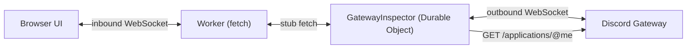

# discordkit × Cloudflare — Gateway Event Inspector

**DevTools for the Discord Gateway.** Connect with a bot token and watch every event Discord sends. The inspector shows the dispatches and the connection lifecycle that other libraries hide.

> **Status: complete.** Runtime and UI both shipped. See [the spec](../../docs/gateway-example-spec.md).

Built on [`@discordkit/gateway`](../../packages/gateway) and running on a **Cloudflare Worker + Durable Object**. A Durable Object is the only serverless primitive that provides what the Gateway needs: a persistent, singleton, outbound WebSocket.

## Why this exists

Discord's own sample app does not use the Gateway; it uses HTTP interactions. Community examples stop at "here is how to connect." **No tool exists for _seeing_ Gateway traffic**, so developers debug it with `console.log`.

The Gateway's most common failure is silent. Without the privileged `MESSAGE_CONTENT` intent, your bot still receives every `MESSAGE_CREATE`, but `content` is an empty string. Your command matching compares `""` against `"!help"` and does nothing. No error, no exception, no log line. This tool shows that state and names the intent you are missing.

## What it does

- **Multi-track timeline.** One lane per event type instead of a single histogram, so a burst shows which events caused it. Zoom from 25% to 1000%, drag to select a time slice, pan a selection, and hide a track to drop its events from the list.
- **Payloads read as Discord data.** In the collapsible tree, snowflakes show their creation time decoded from the id, timestamps show relative age, URLs become links, and an empty string is labelled. Right-click any node to copy its value, path, or JSON. Toggle `camel`/`snake` to compare the shape discordkit gives your handler against the wire format.
- **Recording is separate from the connection.** Pause capture while the Gateway session stays alive, or record only the event types you need. Neither action costs a reconnect.
- **Intent pre-flight.** The inspector reads your application's flags over REST. If you select a privileged intent that the Developer Portal has not enabled, the inspector marks it before you connect. Otherwise you learn about it from a `4014` close.
- **Guild filter.** Built from the `GUILD_CREATE` events already in the buffer, so a bot in many guilds narrows to the one you are testing.
- **Lifecycle separators.** `connected`, `disconnected`, and `connection lost` rules in the event list, so a gap in the stream reads as a reconnect instead of silence.

## Architecture



The DO constructs its **own** `GatewayConnection` rather than using the package's default `gateway` singleton. Module globals are per-isolate, so each Durable Object instance owns its socket.

It also subscribes through `onDispatch` instead of the typed per-event handlers. An inspector wants every event, including ones with no typed module yet, and it takes its intents from the UI rather than from the handlers it registers:

```ts
const connection = new GatewayConnection({ token, intents, scheduler });

connection.onDispatch((event) => {
  record(event.type, event.data);
});
connection.connect();
```

A normal bot does the opposite: subscribe with `onMessageCreate` and let the connection derive its own intents.

## Running it

| What         | Command               | Needs               |
| ------------ | --------------------- | ------------------- |
| Local dev    | `vp run dev`          | a bot token         |
| Tests        | `vp test`             | nothing             |
| Bundle check | `vp run check:bundle` | packages built      |
| Deploy       | `wrangler deploy`     | your own CF account |

`vp run dev` runs the Durable Object locally through Miniflare, which executes the **real workerd runtime**, while Vite serves the SPA with HMR. One server, fully offline, and no Cloudflare account. SQLite-backed DO storage works only locally; `wrangler dev --remote` rejects it.

### Your bot token

The inspector takes a token in the UI, so **it runs with no setup**. Paste a token and select Connect. The token goes to the Durable Object, which opens the Gateway connection server-side. The browser never stores it.

To avoid pasting it each time, put it in a local `.env`:

```sh
# examples/with-cloudflare/.env  (gitignored)
DISCORD_BOT_TOKEN=your-token-here
```

`.env.schema` is committed and declares the shape; `.env` holds real values and is gitignored. The dev task runs through `varlock run`, which validates against the schema and injects the values as Worker bindings.

> **Note:** this skips `@varlock/cloudflare-integration`'s in-Worker `ENV` import on purpose. That import requires the `nodejs_compat` flag, and this example exists to prove the Gateway runs on the bare Workers runtime. The CLI runs in Node outside the Worker, which provides schema validation and `.env` watching without the runtime dependency. `varlock-wrangler` does not fit either: it shells out to `wrangler`, while this dev server is Vite plus the Cloudflare plugin.

## Two checks, and why both are needed

`nodejs_compat` is **off** on purpose. `@discordkit/gateway` claims to run on the bare Workers runtime: Web-standard `WebSocket`, with no Node builtins on the hot path. Two checks enforce that claim.

- **`vp test`** proves the code _runs_. It drives a real Durable Object inside workerd through `@cloudflare/vitest-pool-workers`.
- **`vp run check:bundle`** proves it _deploys_. A `wrangler deploy --dry-run` fails when the bundle pulls in a Node builtin.

**The test suite alone is not enough.** The Vitest pool runs inside workerd, but its module resolution is permissive because Vitest itself needs Node interop. `node:fs` and `node:net` resolve there. To confirm this, `import { Buffer } from "node:buffer"` was added to the gateway's `connection.ts`: the suite stayed green while the bundle check failed. Run both.

> **Note:** Cloudflare documents WebSockets in Durable Objects as [unsupported with per-file storage isolation](https://docs.cloudflare.com/workers/testing/vitest-integration/known-issues/), with `--max-workers=1 --no-isolate` as the workaround. That applied to the Vitest 3-era pool. In v4 the `isolatedStorage` and `singleWorker` options no longer exist, and this suite passes without the workaround.
>
> Most guides also show the older `defineWorkersConfig` and `poolOptions.workers` shape. That shape fails here with `Missing "./config" specifier`, because the pool is now a `cloudflareTest()` plugin.

## Related

- [`@discordkit/gateway`](../../packages/gateway) — the Gateway client
- [`@discordkit/client`](../../packages/client) — the REST API, including `getGatewayBot`
- [Example spec](../../docs/gateway-example-spec.md) · [Package spec](../../docs/gateway-package-spec.md)

## License

MIT
