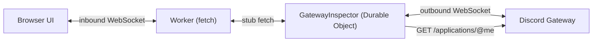

# discordkit × Cloudflare — Gateway Event Inspector

**DevTools for the Discord Gateway.** Connect with a bot token and watch every event Discord sends you — the dispatches _and_ the connection lifecycle that every library hides.

> **Status: complete.** Runtime and UI both shipped. See [the spec](../../docs/gateway-example-spec.md).

Built on [`@discordkit/gateway`](../../packages/gateway), running on a **Cloudflare Worker + Durable Object** — the only serverless primitive that offers what the Gateway needs: a persistent, singleton, outbound WebSocket.

## Why this exists

Discord's own sample app doesn't use the Gateway at all (it's HTTP interactions), and the community examples are all "here's how to connect." **Nobody has built a tool for _seeing_ Gateway traffic** — developers debug it with `console.log` archaeology.

The Gateway's most notorious failure is silent. Without the privileged `MESSAGE_CONTENT` intent, your bot still receives every `MESSAGE_CREATE` — with `content` as an empty string. Your command matching compares `""` against `"!help"`, finds nothing, and does nothing: no error, no exception, no log line. This tool makes that visible, naming the intent you're missing.

## What it does

- **Multi-track timeline** — a lane per event type rather than one histogram, so a burst tells you _what_ burst. Zoom 25%–1000%, drag to select a time slice, pan a selection, and toggle a track's visibility to drop it from the list.
- **Payloads read as Discord data** — a collapsible tree where snowflakes show their creation time (decoded from the id), timestamps show relative age, URLs are links, and an empty string is called out. Right-click any node to copy its value, path, or JSON. Toggle `camel`/`snake` to see the exact transform discordkit applies.
- **Recording is separate from the connection** — pause capture while the Gateway session stays alive, or record only the event types you care about. Neither costs a reconnect.
- **Intent pre-flight** — the inspector reads your application's flags over REST, so a privileged intent you selected but _haven't_ enabled in the Developer Portal is flagged before you connect, rather than surfacing as a `4014` close.
- **Guild filter** — built from the `GUILD_CREATE` events already in the buffer, so a bot in many guilds can be narrowed to the one you're testing.
- **Lifecycle separators** — `connected` / `disconnected` / `connection lost` rules in the event list, so a gap in the stream reads as a reconnect rather than silence.

## Architecture



The DO passes an **explicit** `connection` to each subscription rather than using the package's ambient singleton — module globals are per-isolate, so ambient state is the wrong shape here. It's also where the handlers declare the intents:

```ts
const connection = new GatewayConnection({
  token,
  intents: intentsFor(onMessageCreate)
});
```

## Running it

| What         | Command               | Needs               |
| ------------ | --------------------- | ------------------- |
| Local dev    | `vp run dev`          | a bot token         |
| Tests        | `vp test`             | nothing             |
| Bundle check | `vp run check:bundle` | packages built      |
| Deploy       | `wrangler deploy`     | your own CF account |

`vp run dev` runs the Durable Object locally through Miniflare, which executes the **real workerd runtime**, while Vite serves the SPA with HMR — one server, genuinely offline, no Cloudflare account needed. SQLite-backed DO storage in fact works _only_ locally; `wrangler dev --remote` rejects it.

### Your bot token

The inspector takes a token in the UI, so **you can run it with no setup at all** — paste a token, hit Connect. The token goes to the Durable Object, which opens the Gateway connection server-side; it is never stored in the browser.

If you'd rather not paste it each time, put it in a local `.env`:

```sh
# examples/with-cloudflare/.env  (gitignored)
DISCORD_BOT_TOKEN=your-token-here
```

`.env.schema` is committed and declares the shape; `.env` holds real values and is gitignored. The dev task runs through `varlock run`, which validates against the schema and injects the values as Worker bindings.

> **Note:** this deliberately skips `@varlock/cloudflare-integration`'s in-Worker `ENV` import, which would require the `nodejs_compat` flag — and proving the Gateway runs on the _bare_ Workers runtime is this example's whole point. The CLI runs in Node outside the Worker, so we get schema validation and `.env` watching without the runtime dependency. (`varlock-wrangler` doesn't fit either, since it shells out to `wrangler` while our dev server is Vite plus the Cloudflare plugin.)

## Two checks, and why both are needed

`nodejs_compat` is deliberately **off**. `@discordkit/gateway` claims to run on the bare Workers runtime — Web-standard `WebSocket`, no Node builtins on the hot path — and that claim is worth enforcing rather than trusting.

- **`vp test`** proves the code _runs_: it drives a real Durable Object inside workerd via `@cloudflare/vitest-pool-workers`.
- **`vp run check:bundle`** proves it _deploys_: a `wrangler deploy --dry-run` that fails if the bundle pulls in a Node builtin.

**The test suite alone is not enough.** The Vitest pool runs inside workerd but with permissive module resolution — Vitest itself needs Node interop — so `node:fs` and `node:net` resolve happily there. Verified by injecting `import { Buffer } from "node:buffer"` into the gateway's `connection.ts`: the suite stayed green while the bundle check failed with wrangler's warning. Run both.

> **Note:** Cloudflare documents WebSockets in Durable Objects as [unsupported with per-file storage isolation](https://docs.cloudflare.com/workers/testing/vitest-integration/known-issues/), workaround `--max-workers=1 --no-isolate`. That applied to the Vitest 3-era pool — in v4 the `isolatedStorage` and `singleWorker` options no longer exist, and this suite passes with no workaround. Most guides still show the older `defineWorkersConfig` + `poolOptions.workers` shape, which fails here with `Missing "./config" specifier`; the pool is now a `cloudflareTest()` plugin.

## Related

- [`@discordkit/gateway`](../../packages/gateway) — the Gateway client
- [`@discordkit/client`](../../packages/client) — the REST API, including `getGatewayBot`
- [Example spec](../../docs/gateway-example-spec.md) · [Package spec](../../docs/gateway-package-spec.md)

## License

MIT
