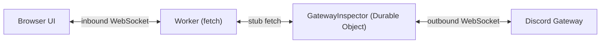

# discordkit × Cloudflare — Gateway Event Inspector

**DevTools for the Discord Gateway.** Connect with a bot token and watch every event Discord sends you — the dispatches _and_ the connection lifecycle that every library hides.

> **Status: spike.** The Worker + Durable Object runtime is proven and tested; the inspector UI is next. See [the spec](../../docs/gateway-example-spec.md).

Built on [`@discordkit/gateway`](../../packages/gateway), running on a **Cloudflare Worker + Durable Object** — the only serverless primitive that offers what the Gateway needs: a persistent, singleton, outbound WebSocket.

## Why this exists

Discord's own sample app doesn't use the Gateway at all (it's HTTP interactions), and the community examples are all "here's how to connect." **Nobody has built a tool for _seeing_ Gateway traffic** — developers debug it with `console.log` archaeology.

The Gateway's most notorious failure is silent. Without the privileged `MESSAGE_CONTENT` intent, your bot still receives every `MESSAGE_CREATE` — with `content` as an empty string. Your command matching compares `""` against `"!help"`, finds nothing, and does nothing: no error, no exception, no log line. This tool makes that visible, naming the intent you're missing.

## Architecture



The DO passes an **explicit** `connection` to each subscription rather than using the package's ambient singleton — module globals are per-isolate, so ambient state is the wrong shape here. It's also where the handlers declare the intents:

```ts
const connection = createConnection({
  token,
  intents: intentsFor(onMessageCreate)
});
```

## Running it

| What         | Command               | Needs               |
| ------------ | --------------------- | ------------------- |
| Local dev    | `vp run dev`          | a bot token         |
| Tests        | `vp test`             | nothing             |
| Bundle check | `vp run check:bundle` | packages built      |
| Deploy       | `wrangler deploy`     | your own CF account |

`wrangler dev` runs the Durable Object locally through Miniflare, which executes the **real workerd runtime** — so local development is genuinely offline and needs no Cloudflare account. SQLite-backed DO storage in fact works _only_ locally; `wrangler dev --remote` rejects it.

Your bot token never leaves your machine in local mode and is never committed.

## Two checks, and why both are needed

`nodejs_compat` is deliberately **off**. `@discordkit/gateway` claims to run on the bare Workers runtime — Web-standard `WebSocket`, no Node builtins on the hot path — and that claim is worth enforcing rather than trusting.

- **`vp test`** proves the code _runs_: it drives a real Durable Object inside workerd via `@cloudflare/vitest-pool-workers`.
- **`vp run check:bundle`** proves it _deploys_: a `wrangler deploy --dry-run` that fails if the bundle pulls in a Node builtin.

**The test suite alone is not enough.** The Vitest pool runs inside workerd but with permissive module resolution — Vitest itself needs Node interop — so `node:fs` and `node:net` resolve happily there. Verified by injecting `import { Buffer } from "node:buffer"` into the gateway's `connection.ts`: the suite stayed green while the bundle check failed with wrangler's warning. Run both.

> **Note:** WebSockets in Durable Objects are [unsupported with the pool's per-file storage isolation](https://docs.cloudflare.com/workers/testing/vitest-integration/known-issues/), and holding a WebSocket is this DO's entire job — so `isolatedStorage` is off in `vite.config.ts`. Without that the suite fails with an opaque storage error.

## Related

- [`@discordkit/gateway`](../../packages/gateway) — the Gateway client
- [`@discordkit/client`](../../packages/client) — the REST API, including `getGatewayBot`
- [Example spec](../../docs/gateway-example-spec.md) · [Package spec](../../docs/gateway-package-spec.md)

## License

MIT
