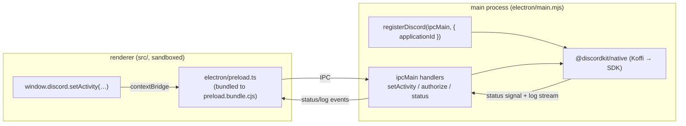

# discordkit × Electron — Rich Presence Visualizer

An Electron app showing Discord **Rich Presence** via [`@discordkit/native`](../../packages/native) (the Social SDK bridge) running in the Electron **main process**, driven from the renderer over the typed IPC bridge in [`@discordkit/electron`](../../packages/electron).

The renderer is a **live editor** modelled on Discord's Developer Portal Rich Presence Visualizer: edit details/state/status-display-type/images/timestamps/party/buttons and the in-app preview updates reactively while the presence is pushed to Discord (debounced). Built with **React Aria Components**, **React Hook Form + Valibot**, and **Tailwind v4**. A "Show Code" tab emits the equivalent `setActivity({...})`.

> **No login required.** Rich presence is set over RPC to the running Discord desktop client — `SetApplicationId` → `UpdateRichPresence`, no OAuth. (The presence shows as the activity line **under your name**, not the auto-detected game banner, which is Discord's own process detection and not an SDK feature.)

The SDK is native (Koffi FFI) and must run in a Node context, so it lives in the main process. The sandboxed renderer never touches FFI — it talks to `window.discord`, exposed by a preload bundle.

## Architecture



- **`electron/main.mjs`** — ESM main; creates the window and calls `registerDiscord(ipcMain, …)`. Readiness is awaited inside an async IIFE (`await app.whenReady()` — never at module top level) so Playwright's `_electron.launch` doesn't deadlock.
- **`electron/preload.ts`** — calls `exposeDiscord(contextBridge, ipcRenderer)`. The renderer is **sandboxed** (secure default), so this is **bundled** into a self-contained `preload.bundle.cjs` via the `preload` pack task (sandboxed preloads can't import from `node_modules`). `electron` stays external.
- **`src/`** — the renderer (React + React Aria + React Hook Form + Valibot + Tailwind v4); imports `@discordkit/electron/renderer` for `window.discord` typings. `useDiscordStatus` (useSyncExternalStore over the IPC status stream) and `useDiscordPresence` (debounced push) wrap the bridge.

## Prerequisites

1. A Discord application with the **Social SDK enabled** (Developer Portal).
2. The **Social SDK download** for your platform — it can't be redistributed, so download it yourself. `.env` points `DISCORD_SDK_PATH` at the repo's `vendor/discord-social-sdk/<version>` by default (relative to this example).
3. The Discord **desktop client** running (presence goes over RPC to it).
4. Copy `.env.schema` → `.env` and set `DISCORD_APPLICATION_ID` (and `DISCORD_SDK_PATH` if your SDK lives elsewhere — a relative path is resolved against this example's root, so it's portable).

## Run

First build the workspace packages (once, from the repo root):

```sh
vp run build
```

Then, from this directory:

```sh
vp run start
```

That's it — `start` builds the renderer + the sandboxed preload bundle and launches Electron in one step. No login required: presence is set over RPC to your running Discord desktop client (`SetApplicationId` → `UpdateRichPresence`). Edit the fields and watch the card update live; check your Discord profile.

> The launcher scrubs `ELECTRON_RUN_AS_NODE` for you, so it works from any terminal (including VS Code's, which sets that variable and would otherwise make Electron boot as plain Node with no window).

### Live UI editing (HMR)

For hot-reloading the renderer while you tweak the UI, run two terminals:

```sh
vp run preload   # bundle the preload once (only needed if you change it)
vp run dev       # terminal 1: renderer dev server on :5173

# terminal 2: launch Electron pointed at the dev server (loads the URL, not dist/)
ELECTRON_RENDERER_URL=http://127.0.0.1:5173 node electron/launch.mjs
```

Edit any field and the presence updates live (no login — see the note below). Toggle **presence on/off** above the preview, or **Reset to defaults** to restore the starting values. Then check your own Discord profile to see the result.

> **You won't see your own buttons.** Discord only shows Rich Presence buttons to _other_ users viewing your profile — never on your own. To verify buttons work, have a friend (or a second account) look at your profile. (Everything else — details, state, images, timestamps, party — shows on your own profile.)

## Smoke test (local, maintainer-driven)

A Playwright `_electron.launch` smoke verifies the renderer wires up to the SDK over IPC. It needs the real SDK, so it's **local-only** (skips without the env):

```sh
DISCORD_APPLICATION_ID=… DISCORD_SDK_PATH=… vp run smoke
```
