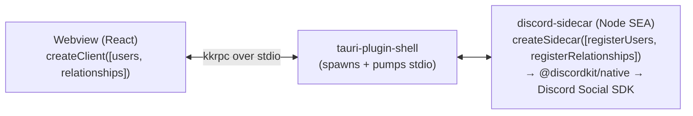

# discordkit × Tauri — Friends List Studio

A live, tunable **unified friends list** built on your real Discord relationships,
rendered against [Discord's design guidelines][guidelines]. The social-graph
counterpart to the [with-electron][electron] Rich Presence Visualizer: tweak the
controls, watch the list update — but here the goal is helping you design and test a
**friends list** for your own game, against the patterns Discord recommends
(sectioning by availability, the status matrix, Game-vs-Discord friend tiers, the
"universal communication" badge, and the connection point).

It's also the example for [`@discordkit/tauri`][tauri]: the Discord Social SDK runs
in a Node **sidecar** (Tauri's Rust core can't load the FFI), bridged to the webview
over a typed kkrpc connection.

## Architecture



- **`sidecar/discord.sidecar.ts`** — the sidecar entry. Composes only the **users + relationships** domains, so the built binary bundles exactly that native surface. Built to a single executable via Node SEA (`vp pack` `exe`); `koffi`'s native addon ships beside it (it can't be embedded in a SEA — see below).
- **`src/discord.ts`** — `createClient([usersSlice, relationshipsSlice], { expose: keyringRelay(…) })`, the webview half: a lazy singleton bridge that also relays the OS keychain back to the sidecar's token store.
- **`src/machine.ts`** — the connection + friends lifecycle as an XState machine: a long-lived status listener feeds the SDK's connection state in, transient actors run connect/logout/load, and both user-connect and silent boot-resume land in `connected` the same way. The UI just renders the current machine state.
- **`src/sections.ts`** — sections the list by availability per the guidelines.
- **`src/components/`** — the friends-list UI (FriendsList, Section, FriendEntry, StatusDot, DiscordBadge, ConnectionPoint, ControlsPanel, FriendsSkeleton), per Discord's Figma "Friend List Starter Pack".
- **`src-tauri/`** — the Tauri shell: registers `tauri_plugin_shell`, grants the
  sidecar shell permissions (`capabilities/default.json`), and wires the sidecar
  binary (`externalBin`) + koffi addon (`resources`).

## Prerequisites

Tier 1 (the default) needs **no backend and no client secret** — Discord auth is
OAuth2 **PKCE** (a public client), so the whole flow runs locally in the sidecar.

1. **Rust toolchain** (Tauri builds a native shell) — <https://rustup.rs>.
2. A **Discord Application** (free): <https://discord.com/developers/applications>.
   - Put its **Application ID** in `.env` as `DISCORD_APPLICATION_ID` (it's public,
     not a secret; see `.env.schema`).
   - Under **OAuth2 → Redirects**, add `http://127.0.0.1/callback` (literal `127.0.0.1`, no port — the loopback redirect the SDK uses when it falls back to the browser because the Discord desktop app isn't running; when the desktop app _is_ running it authorizes over RPC and never touches this). This is separate from any web-app `localhost` redirects you may already have registered.
3. The **Discord Social SDK** library. It can't be redistributed, so download it
   from the Developer Portal (`Social SDK → Downloads`) and set `DISCORD_SDK_PATH`
   in `.env` to its location. (Prefer `DISCORD_SDK_PATH` over the conventional
   `./lib/discord_social_sdk` fallback: in `tauri dev` the sidecar's working
   directory is `src-tauri/`, so a relative drop folder must live under there —
   an explicit path avoids the ambiguity.)

   If the SDK can't be found, the app shows a clear "Couldn't start the Discord
   SDK" panel (with the exact paths it checked) and a Retry — not a silent hang.

## Run

```bash
# from the repo root
vp install

# from examples/with-tauri
vp run start      # builds the sidecar, then launches the Tauri app (tauri dev)
```

`start` builds the sidecar (`vp run sidecar` → Node SEA + stages koffi) and runs
`tauri dev`, which starts the Vite dev server and opens the app window. Sign in with
Discord via the connection point; your real friends populate the list. Adjust the
Studio controls to preview density, the Discord badge, the connection point, the
game title, and a simulated in-game section.

### Session persistence (authorize once)

You authorize through the browser only the **first** time — the session is stored
in your **OS credential vault** (Windows Credential Manager / macOS Keychain /
Linux Secret Service) and later launches reconnect silently, refreshing the token
as needed. `@discordkit/native` owns this lifecycle; the Tauri-specific bit is just
_where_ the bytes live: `@discordkit/tauri/keyring` puts them in the OS vault via
[`tauri-plugin-keyring`][keyring] (the sidecar can't reach the vault directly, so
its token store relays through the webview). Setup adds the `tauri-plugin-keyring`
crate to `src-tauri`, the `tauri-plugin-keyring-api` npm bindings, and the
`keyring:allow-*-password` capabilities. (Don't want the vault? Swap in native's
addon-free `fileStore` — encrypted-file persistence with no extra setup.) The
**Log out** button clears the stored session.

[keyring]: https://github.com/HuakunShen/tauri-plugin-keyring

### Smoke tests (maintainer-run, over CDP)

`e2e/*.smoke.ts` drives the connection + friends flows against a **real running app** — there's no Playwright launcher for a Tauri shell, so the tests attach to its WebView2 webview over the Chrome DevTools Protocol (Windows only). Run it in two terminals:

```bash
vp run start:cdp   # terminal 1 — launches the app with CDP on :9222
vp run smoke       # terminal 2 — attaches and drives the flows
```

The default run covers the flows that need no Discord auth (the bridge wires up, the app boots to a settled state, the Connect button stays busy when clicked). The full matrix — approve, friends-load, refresh, logout, decline, and Discord-not-running — needs a human to answer the Discord prompt, so it's gated behind `DISCORD_INTERACTIVE=1`:

```bash
DISCORD_INTERACTIVE=1 vp run smoke   # each flow prints the action to take, then waits
```

Re-run after changes to re-verify the lifecycle without hand-driving each case. Not a CI gate — it needs the real SDK and a running app.

### Why the sidecar build has extra steps

`@discordkit/native` loads the SDK through `koffi`, a **native addon** (`.node`). A
Node SEA bundles JavaScript only — it can't embed a native addon — so the build
(`scripts/build-sidecar.mjs`) ships `koffi.node` in a `koffi/<triplet>/` folder
beside the executable, and the sidecar sets `process.resourcesPath` to its own dir
so koffi finds it. Tauri's `bundle.resources` carries the addon into packaged
builds.

## Tier 2 (optional): Steam reconciliation

Setting `STEAM_BACKEND_URL` enables a Steam panel that reconciles your Discord and
Steam friend graphs — demonstrating the cross-platform unified list. Unset (the
default), the panel is hidden and the app is exactly Tier 1. Steam **requires a
small companion backend** (the Steam Web API key is a secret and Steam blocks CORS);
see `docs/with-tauri-example-spec.md`. Not built yet — a later pass.

[guidelines]: https://docs.discord.com/developers/discord-social-sdk/design-guidelines
[electron]: ../with-electron
[tauri]: ../../packages/tauri
